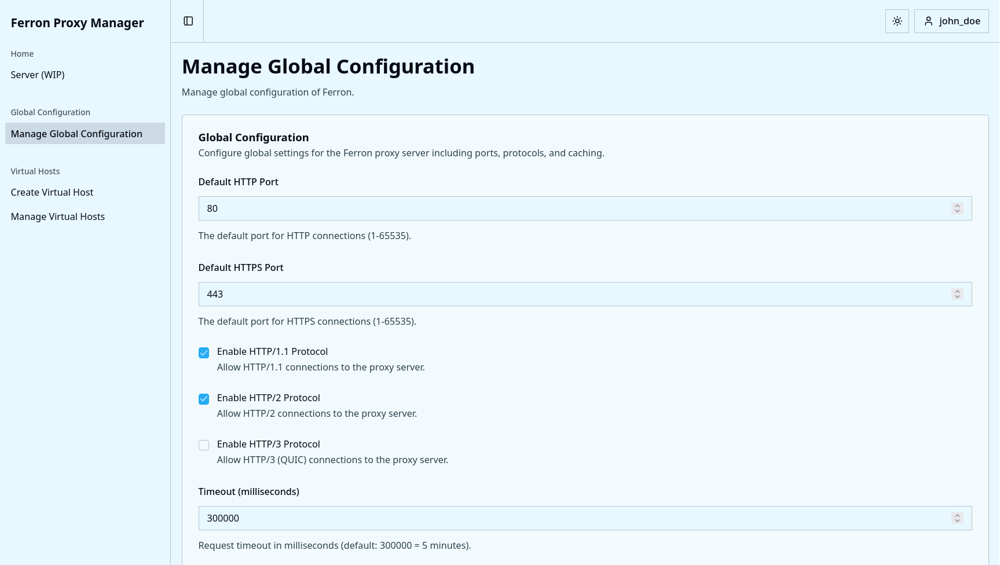
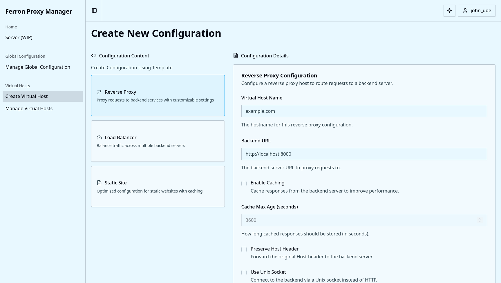
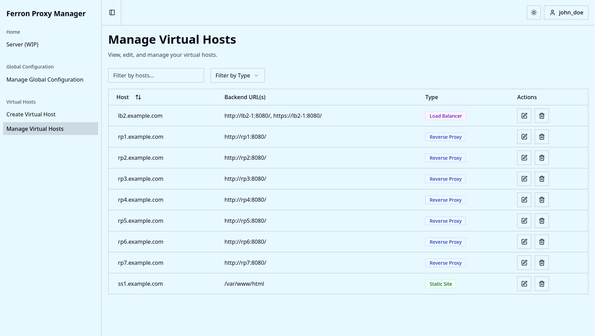

<h1 align="center">Ferron Proxy Manager</h1>

<div align="center">

[](https://wakatime.com/badge/github/kun-codes/Ferron-Proxy-Manager)

</div>

> [!IMPORTANT]
> Ferron Proxy Manager is currently in alpha stage. Breaking changes are expected.

Ferron Proxy Manager is for self-hosters who want to configure the [Ferron](https://github.com/ferronweb/ferron) web
server without writing config files. It provides an easy to use web UI to manage your Ferron web server.

## Features

- Create routing for reverse proxies, load balancers and static file hosts from a single web UI.
- Route reverse proxy traffic to backend URLs or Unix sockets.
- Serve static sites with SPA mode, compression, directory listing, and precompressed file support.
- Control caching globally and per virtual host.
- Manage global defaults like HTTP/HTTPS ports, protocol support (HTTP/1.1, HTTP/2, HTTP/3), and timeouts.
- Reload Ferron automatically on configuration changes.
- Use light, dark, or system theme in the web UI.

## Screenshots

### Manage Global Configuration



### Create Virtual Host



### Manage Virtual Hosts



## Installation

1. Install [Docker](https://docs.docker.com/install/) and [Docker Compose](https://docs.docker.com/compose/install/).
2. Download the [docker-compose.yml](./docker-compose.yml) file.
3. Provide values for the environment variables in the docker-compose file.
4. Create a file named `ferron.kdl` in the same directory as the `docker-compose.yml` file.
5. Add the following to `ferron.kdl`:

   ```kdl
   include "/etc/ferron-proxy-manager/main.kdl"

   "subdomain.example.com" {
       proxy "http://frontend:3000"
   }
   ```

   Replace `subdomain.example.com` with the domain you want to use for your Ferron Proxy Manager instance.

6. Run `docker network create fpm-network` to create the external Docker network.
7. Run `docker-compose up -d` in the same directory as the `docker-compose.yml` file.

Note: Make sure to turn off new users signups once you have created the required user(s).

## License

The project is open source and is available under the [AGPL-3.0 License](./LICENSE).
